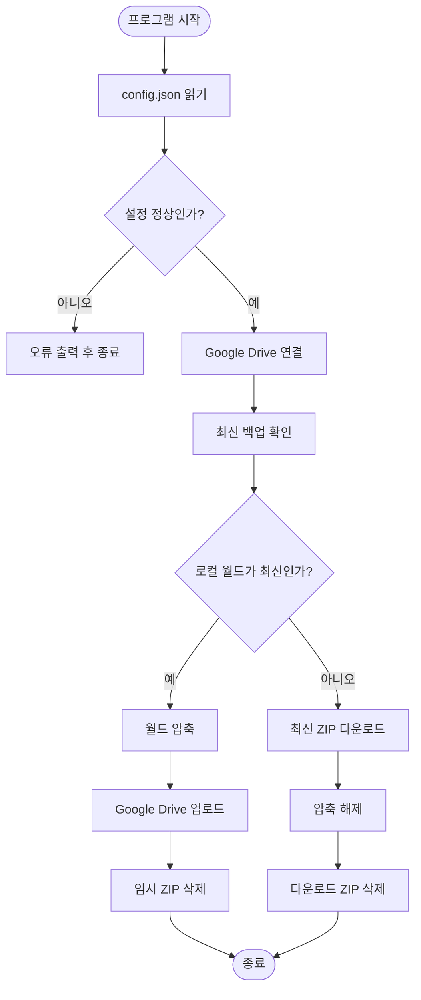

# Program Flow

```mermaid
flowchart TD

A([프로그램 시작])

A --> B[config.json 읽기]

B --> C{설정 정상인가?}

C -- 아니오 --> D[오류 출력 후 종료]

C -- 예 --> E[Google Drive 연결]

E --> F[최신 백업 확인]

F --> G{로컬 월드가 최신인가?}

G -- 예 --> H[월드 압축]

H --> I[Google Drive 업로드]

I --> J[임시 ZIP 삭제]

J --> K([종료])

G -- 아니오 --> L[최신 ZIP 다운로드]

L --> M[압축 해제]

M --> N[다운로드 ZIP 삭제]

N --> K
```